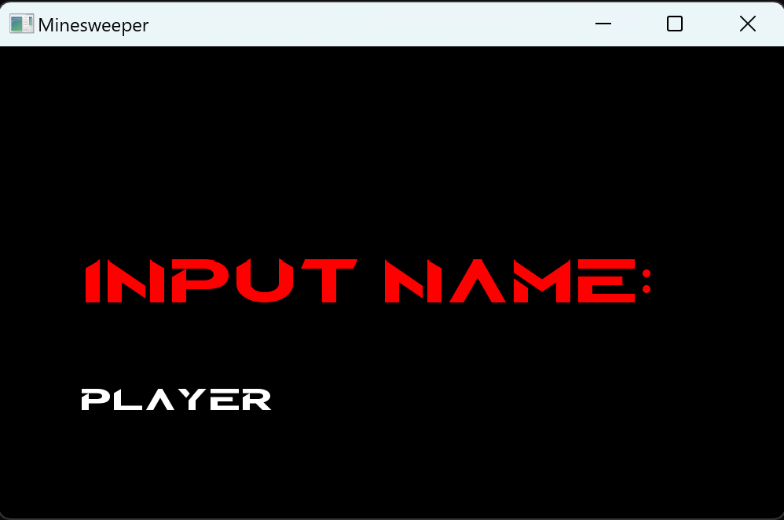

## Name
Saper

## Description
Saper is a logic-based computer game, which requires deductional and computaional skills. The players' goal is uncovering all of the cells of the board; however, he must avoid mines which are hidden within the covered cells. Each uncovering of a cell gives the player information about the number of neighbouring mines. With this information the player can make a deduction whether a cell contains a mine or not. Saper requires strategy and making risky decisions from the player, and its dynamic character and ranodm arrangement of mines makes every playthrough a unique experience.

## Usage
The initial menu is presented as follows:

In order to proceed, the player is required to enter their desired nickname.

Subsequently, the following menu is displayed:

Within this menu, three buttons are available for selection, navigable via arrow keys, with confirmation achieved by pressing the Enter key. By selecting the "Ranking" button, the following submenu is presented:

Ranking Menu:

The ranking menu showcases players' scores for each difficulty level. Horizontal arrow keys can be used to navigate between difficulty options.

Play Menu:

Upon clicking the "Play" button, this menu materializes. Players are provided with the choice to initiate a new game or load a previously saved game. Opting for a new game leads to the subsequent menu.

Difficulty Menu:

Upon selecting a desired difficulty level, the actual gameplay commences.

Game:

This is the in-game interface, representing the active gameplay state.

## Classes
1. Klasa GameInetrface - responsible for general game logic and working with the GUI
2. Klasa Board - holds the grid of cells and is responsible for actions connected to cells
3. Klasa Cell - represents a single cell of the board and holds information about each cell and its neighbours
    Flag
    Mine
    Number
    Covered
4. Klasa MenuElement - responsible for the menu of the game
    ChooseGameMenu
    ChooseGamemodeMenu
    nameInputWindow
    Ranking
    RankingHUD
    StartMenu
